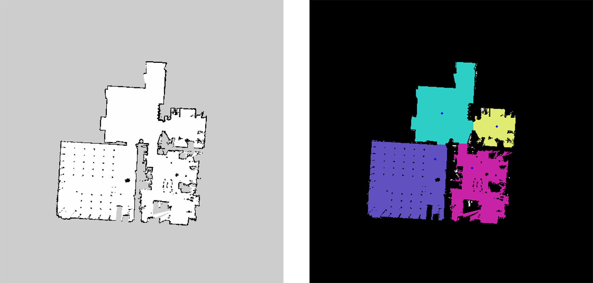
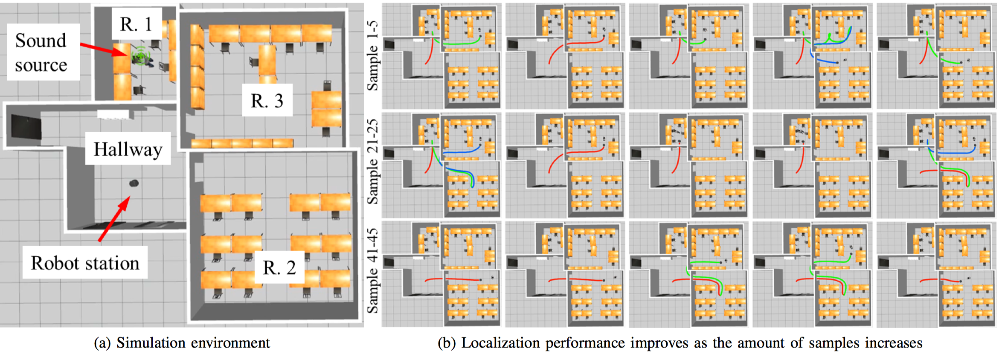

# Eddiebot ROS

 

This repo provides several ROS packages for [Parallax Eddie Robot](https://www.generationrobots.com/en/401394-eddie-robot-platform-parallax.html) (for short EddieBot), where we implements 1) a basic bringup driver for controlling EddieBot; 2) EddieBot navigation stack; 3) Several room segmentation algorithm; 4) EddieBot Gazebo simulation environment; 5) EddieBot ROS-related visualization tools; 6) EddieBot indoor environment sound source localization simulator (for more information above this task, please visit [HERE](https://github.com/TooSchoolForCool/CIESSL-py)).

## 1. Demo

**SLAM Map Building**

**Room Segmentation**

**Indoor-Environment Sound Source Localization Simulation**

## 2. Installation

Several dependencies are need to be installed before using our EddieBot ROS packages. A more detailed instructions are provided in each package, a brief guideline is listed below:

- [eddiebot bringup](eddiebot/eddiebot_bringup/#1-dependency)
- [navigation stack](eddiebot_apps/eddiebot_navigation/#1-dependencies)
- [room segmentation](eddiebot_apps/room_segmentation/#1-installation) (optional)
- [gazebo environment](eddiebot_simulator/eddiebot_gazebo#1-installation) (optional)
- [sound source localization simulation](eddiebot_apps/eddiebot_ssl#2-installation) (optional)

Note: you do not have to install ALL those dependencies, just install what you need.

## 3. Usage &Brief Guideline

Here is a brief guideline for you to navigate this repo

- [eddiebot](eddiebot) implements basic driver for running EddieBot
- [eddiebot_apps](eddiebot_apps) implements several applications of EddieBot, which includes: 1) EddieBot navigation; 2) SSL simulation; 3) Room segmentation
- [eddiebot_simulator](eddiebot_simulator) implements eddiebot gazebo simulation environment
- [eddiebot_viz](eddiebot_viz) provides visualization tools, like rviz, for eddiebot application

Almost every package is carefully documented, you can find the installation instructions, the usage instructions, and the frequent Q&A in each individual package. Please navigate this repo and check it out.