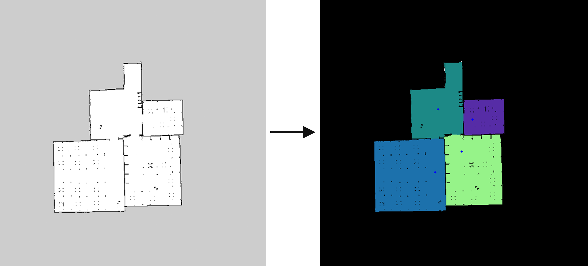

# room_segmentation

This package is developed based on [ipa_room_segmentation](https://github.com/ipa-rmb/autopnp/tree/indigo_dev/ipa_room_segmentation), a detail description could be found [here](http://wiki.ros.org/ipa_room_segmentation).

## 1. Installation

For running this package, several system-based dependencies should be installed,

- libdlib
- opengm

You can use following command to install these dependencies,

```bash
sudo apt-get install ros-kinetic-libdlib ros-kinetic-opengm
```

## 2. Usage

A more detail explanation could be found [here](http://wiki.ros.org/ipa_room_segmentation#General_Procedure). 

### 2.1 Set configuration file

Change the algorithm parameters in the file [room_segmentation_server_params.yaml](ros/params/room_segmentation_server_params.yaml), which could be found at `ros/params` directory, to the wanted settings.

**room_segmentation_algorithm**: Choose which segmentation algorithm should be used. There are 3 available algorithms

- Morphological segmentation
- Distance segmentation
- Voronoi segmentation

Please read the .yaml file for more detail information.

### 2.2 Launch segmentation function

Firstly, launch the segmentation server,

```bash
roslaunch room_segmentation room_segmentation_server.launch
```

Then, launch the room segmentation client, which is implementation in [room_segmentation_client.cpp](ros/src/room_segmentation_client.cpp)

```bash
roslaunch room_segmentation room_segmentation_client.launch
```

*Note: room_segmentation_client subscribes the "/map" topic, make sure this topic does exist. You can try `map_server` to publish the /map topic.*

### 2.3 Data Format Sepcification

The room_segmentation server **ONLY** accepts an 8-Bit single channel image, with 0 as occupied space and 255 as free space. In the **client**, once a map is received, it will converted to a valid 8-bit signal channel image.

The action server returns a result, that has the following parts

* segmented_map: The map with the N found segments drawn in. The value of a pixel indicates its ID, which can be used to find pixels belonging to one room. The IDs start at 1 and go up to N, the **return format is 32-Bit single channel**.
* RoomInformation: For each found room the min/max x/y coordinate of points belonging to this room and the center is provided. See room_segmentation/msg/RoomInformation.msg for details. This can be in pixel coordinates or absolute coordinates, depending on the booleans defined above.
* doorway_points: The fifth algorithm (voronoi random field segmentation) is capable of predicting doorways. If this algorithm is chosen, central points on a computed voronoi graph are returned that were labeled as doorways. 

## 3. Demo

